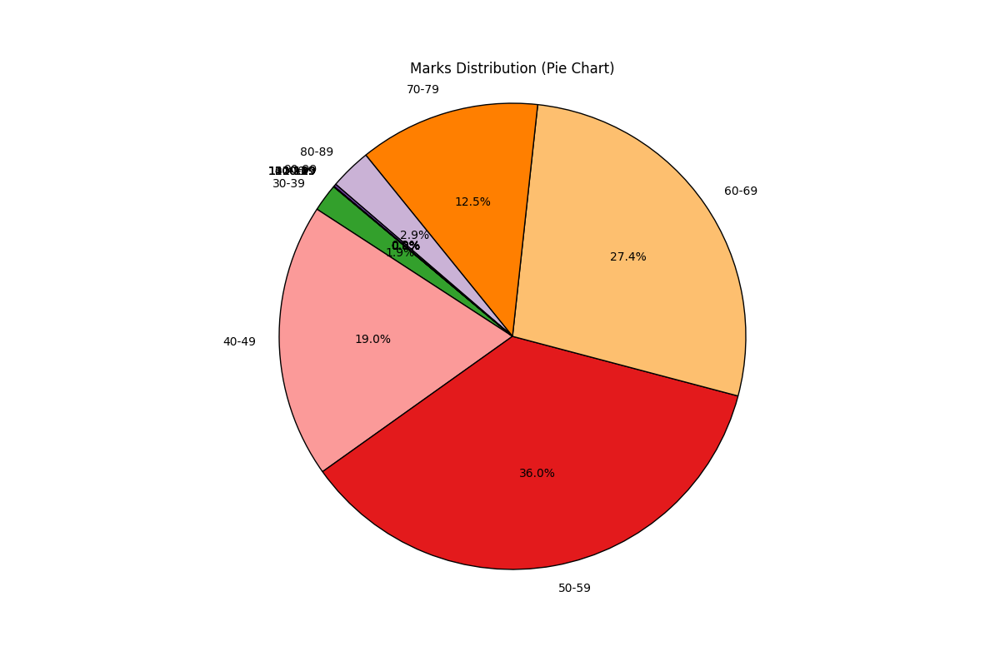

# user_performance_dashboard


**TOWER_CHART**


<p align="center">
  
</p>


**PIE**

<p align="center">
  
</p>


**HEAT**

<p align="center">
  
</p>


```
https://www.trb.tn.gov.in/admin/pdf/6717959105part-B%20results_09112023_.pdf

Pages 1 to 711

each page have 41 users data.

pdf into text into csv
```


# FIX BUG
```
grep -E '^[0-9]{1,5},[0-9]{10},[0-9]{2,3},,$'
```


```
pip install matplotlib
pip install pandas

```

